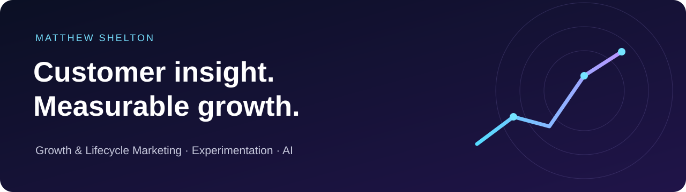

# Matthew Shelton
### Growth & Lifecycle Marketer

I connect customer insight with acquisition, activation, engagement, conversion and retention. My 6+ years in consumer growth span campaign strategy, international GTM and lifecycle programs. I’m bringing that full-customer-journey perspective to technology through experimentation, analytics, CRM automation and AI.

[Connect on LinkedIn](https://www.linkedin.com/in/mattshelton2000/)

## Selected work

| Project | What you can explore | Type |
| :--- | :--- | :--- |
| **[Ray: from first workout to repeatable habit](case-studies/ray.md)** | Customer hypothesis, first-week messages, activation experiments and a 90-day measurement plan | Independent strategy |
| **[Heelys: connecting insight to commercial execution](case-studies/consumer-growth.md#heelys--consumer-growth)** | My role in initiatives contributing to sales growth and sell-through improvement | Professional experience |
| **[DVS: international go-to-market](case-studies/consumer-growth.md#dvs--international-go-to-market)** | A relaunch across 12 distributor markets and three product seasons | Professional experience |

## Selected outcomes

| Context | Reported outcome |
| :--- | :--- |
| Heelys / BBC International | Initiatives contributed to **100%+ sales growth** and **75%+ sell-through improvement** |
| DVS international relaunch | **12 markets**, **three product seasons** and work contributing to **150%+ brand-awareness growth** |
| Andrews University | **10,000+ social interactions** in the first month of targeted campaign work |
| Andrews University community programs | **15% local-business engagement growth** |
| Andrews University international campaigns | **8% international-awareness growth** |

These outcomes come from separate bodies of work. They are not results of a single experiment or claims of sole attribution. Ray is an independent proposal with no claimed performance results.

## How I approach growth

**Understand the customer → identify friction → define a hypothesis → test → measure → improve.**

I’m interested in the connection between the promise that earns attention and the experience that earns a return visit. My work brings together customer research, audience segmentation, creative strategy, lifecycle messaging and performance analysis.

## Growth Lab

I’m developing a space for practical AI workflows, growth teardowns and documented experiments. Future entries will include the problem, a usable deliverable, evaluation criteria and what I learned. Completed projects will be added as they are built and tested.

## Relevant learning

| Certification | Issuer | Completed |
| :--- | :--- | :--- |
| Growth Marketing Foundations | LinkedIn | October 2025 |
| Using Generative AI across the Marketing Lifecycle | LinkedIn | February 2026 |
| Generative AI for Digital Marketers | LinkedIn | February 2026 |
| SEO Foundations | LinkedIn | February 2026 |
| Claude Code in Action | Anthropic | March 2026 |
| Claude Marketing | Claude Marketers | September 2026 |

Explore my background and credentials on [LinkedIn](https://www.linkedin.com/in/mattshelton2000/).
