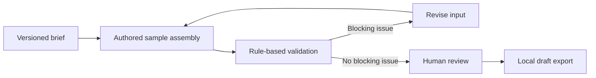

# AI Lifecycle Studio

### From a product brief to a reviewable activation campaign

A free, interactive portfolio project exploring the architecture of an AI-assisted marketing workflow. Built for Matthew Shelton's growth and lifecycle marketing portfolio with AI-assisted development.

**Current version: deterministic sample mode.** No model calls, API keys, web research, email sending or paid services. Campaigns are authored fixtures. The validation, review gate and local exports are working software.

## Try it

Download this project folder and open **index.html** in a browser. No installation is needed. GitHub's file view shows source code rather than running the app.

1. Choose FocusFlow or SkillSpring, two fictional products.
2. Inspect the three-email activation sequence and its source brief.
3. Select a failure scenario to inject an unsupported claim, broken reference or missing consent check.
4. Open Quality review to inspect the findings.
5. Restore the clean sample, confirm human review and approve the demo.
6. Export a JSON draft or Markdown campaign brief. Nothing is sent.

## What this demonstrates

| Capability | Working evidence |
| :--- | :--- |
| Behavioral lifecycle design | Three moments with explicit triggers, actions and outcome events |
| Structured campaign outputs | Versioned JSON object with sources, emails, suppressions and approval state |
| Evidence boundaries | Synthetic briefs and source IDs separated from proposed strategy |
| Quality controls | Six rule categories with deliberately failing scenarios |
| Human oversight | Blocking issues prevent approval; changing inputs resets approval |
| Reproducible evaluation | Automated tests for fixtures, negative cases and exports |
| Honest AI architecture | Clear separation between implemented logic and a future model adapter |

## Workflow



## Why sample mode?

A model subscription is not required to demonstrate workflow design. This version makes each boundary visible and repeatable. It does **not** demonstrate live model reliability, retrieval accuracy, tool-calling execution or production delivery. Those require separate implementation and evaluation.

No campaign lift, time savings or model benchmark is claimed. API cost is zero because there are zero API calls. Browser execution time is not presented as model latency.

## Evaluation

With Node.js installed, run:

```sh
node --test tests/engine.test.cjs
```

Read [the evaluation notes](docs/evaluation.md), [AI integration design](docs/architecture.md) and [tool-testing journal](docs/tool-journal.md).

## Project files

- `index.html`, `style.css`: responsive interface with no external fonts or dependencies
- `engine.js`: authored fixtures, deterministic assembly, review rules and exports
- `app.js`: interaction, approval reset and browser downloads
- `tests/engine.test.cjs`: automated behavioral tests
- `docs/`: architecture, limitations and future comparisons

## Scope and limitations

Source-ID validation checks reference integrity, not whether a claim is truly supported. Claim detection uses a small pattern list and will miss many unsupported statements. The demo uses synthetic data and is not connected to a CRM. Consent flags are a design example, not a substitute for production eligibility logic. The footer fields and sending infrastructure of a real campaign are outside this version.

[Matthew Shelton on LinkedIn](https://www.linkedin.com/in/mattshelton2000/) · [Portfolio](../README.md)
