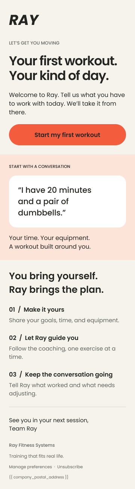
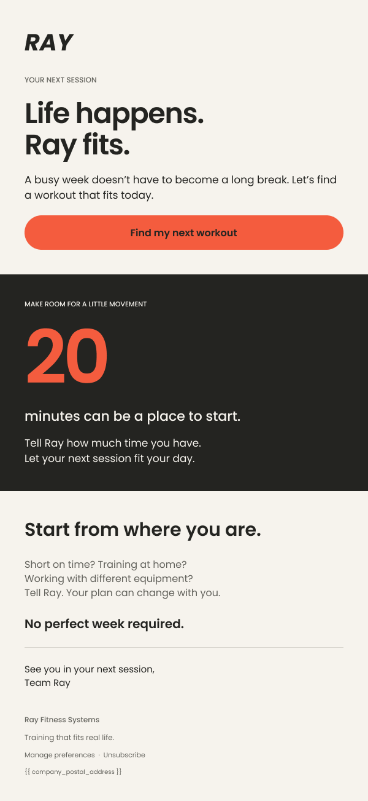
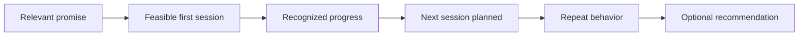

# From a first workout to a repeatable habit

Independent 90-day Growth & Lifecycle Strategy. Based on public information. Not commissioned by or affiliated with Ray. All journeys, messages and experiments below are proposed concepts. They are not shipped product features or measured results.

## Lifecycle email mockups

Designed by Matthew Shelton in Figma. These are independent visual concepts, not official Ray emails, deployed campaigns or measured results.

[Open the full Figma file with desktop and mobile layouts](https://www.figma.com/design/e99rFNf5MD8VNKjVROExqw/?node-id=0-1)

### 01 · Welcome: first-workout activation

**Design rationale:** One primary action, a concrete prompt about available time and equipment and three simple steps make the first workout feel approachable.

| Proposed campaign element | Specification |
| :--- | :--- |
| Subject | Your first workout starts with you |
| Preheader | Tell Ray what fits today. Let’s get moving. |
| Eligibility | Once after signup if no workout is completed and the user is eligible for marketing email. Recheck immediately before sending. |
| Destination | Verified first-workout app link with a web fallback |
| Test | Randomized holdout versus the current welcome journey |
| Primary outcome | First workout completed within 48 hours of assignment |
| Secondary outcome | Second workout within seven days |

### 02 · Return: an easier next session

**Design rationale:** Supportive copy and a manageable starting point invite a return without guilt, discounts or fabricated urgency. The 20-minute reference is a creative example, not a universal training recommendation.

| Proposed campaign element | Specification |
| :--- | :--- |
| Subject | Life happens. Ray fits. |
| Preheader | A shorter session can be your next step. |
| Eligibility | Pilot at seven days without a workout after at least one completed session. Require active access and marketing eligibility. |
| Suppression | Return to training, paused access, cancellation or unsubscribe |
| Destination | Verified app link to the current workout plan |
| Test | Randomized holdout |
| Primary outcome | Completed workout within 72 hours of assignment |
| Secondary outcome | Another workout within seven days |
| Guardrails | Unsubscribes and complaints |

These email-specific evaluation windows are proposed test definitions. They sit alongside the broader seven-day activation hypothesis below and have not been validated.

### Design and production notes

The source file includes 600px desktop and 360px mobile layouts for both concepts. The exports here show welcome on mobile and return on desktop; all four layouts are available in Figma.

Poppins is a concept font substitute and the editable RAY wordmark is a typographic study, not the official logo. A production build would use approved brand assets, live HTML text and buttons, verified destination links and connected preference, unsubscribe and postal-address fields. Email-client rendering and dark mode still need validation.

### The strategic question

How could Ray help someone turn an intention to exercise into a second workout, then a routine that survives a busy week?

### A focused starting audience

My starting hypothesis is that busy adults returning to exercise may value help deciding what to do and fitting it into the time they actually have. I would validate this segment through interviews and onboarding research before expanding acquisition spend.

The job to be done: “Help me get a useful workout done today without spending my limited time planning it.”

Questions to validate: What interrupted their last routine? Is the main barrier time, confidence, planning or accountability? What makes a session feel achievable? Which alternatives are they already using?

### The proposed growth loop

Relevant promise → Feasible first session → Recognized progress → Next session planned → Repeat behavior → Optional recommendation.

The critical handoff is from a completed session to a credible next step. A download or a reminder open would not be enough evidence that the product is delivering value.

### First-week lifecycle concepts

**Day 0 · Make starting feel possible**

Trigger: onboarding completed without a first workout.

Proposed message: “Your week is busy. Your first workout can still fit. Choose a session that works for the time you have today.”

Action: choose a feasible session. Measure first-workout completion rather than message opens alone.

**Day 1 · Match the message to the behavior**

For someone who completed a session: “You made a start. When would your next workout fit?”

For someone who has not started: “Still finding a window? Start with the time you have.”

Action: schedule the next session or return to a feasible first one. Suppress reminders once the intended action happens.

**Day 3 · Help people recover the plan**

Trigger: a planned session was missed, subject to consent and validated event availability.

Proposed message: “Plans change. Want to move your workout to a better time?”

Action: reschedule. Test a supportive restart against a generic reminder without guilt or streak pressure.

**Day 7 · Turn reflection into a next step**

Proposed message: “What worked for you this week? Build next week around that.”

Action: choose a realistic cadence. Show only progress that the product can accurately support with observed activity.

Across the journey: respect channel consent, local time and frequency limits. Avoid sensitive health inferences. These are copy concepts, not existing Ray communications.

### Three experiments I would prioritize

**1. A more achievable first step**

Hypothesis: a time-based session choice could reduce planning friction for new users. Compare an achievable-session prompt with the current onboarding experience after auditing that experience. Primary measure: first-workout completion within seven days. Guardrails: abandonment, negative feedback and signs that shorter starts reduce later engagement.

**2. Plan the second session at the moment of progress**

Hypothesis: asking users to choose their next session after completing the first could increase repeat behavior. Compare a scheduling prompt with the existing completion flow. Primary measure: second-workout completion within seven days of the first. Guardrails: prompt dismissal and notification opt-outs. Scheduling alone is not success.

**3. Make restarting easier**

Hypothesis: a flexible rescheduling message could help users return after a missed plan. Compare supportive restart copy with the current reminder approach. Primary measure: completed workout after an eligible missed session. Guardrails: unsubscribes, complaints and excessive messaging.

For each test, establish the baseline, eligibility rules, randomization unit and minimum detectable effect before choosing a sample size or duration. Do not select winners from small early fluctuations.

### Acquisition that connects to activation

Test problem-led creative around fitting exercise into a busy day against feature-led creative. Keep the landing-page promise consistent with the first-session experience. Evaluate cost per activated user alongside acquisition cost, then check whether cohorts return. A cheap install that never becomes a workout is not the desired outcome.

### Referrals after value

Explore an optional referral invitation after a user has established repeat behavior. Validate the right moment rather than assuming a specific number of sessions. Evaluate whether referred users activate and retain, with guardrails for spam and invitation fatigue.

### Measurement and the 90-day plan

Candidate activation definition: first workout completed and next session scheduled within seven days. Validate whether it predicts subsequent workout completion before treating it as a durable indicator.

Proposed events, subject to instrumentation review: onboarding completed, workout started, workout completed, next session scheduled and referral accepted. Use cohort analysis to understand repeat use. Separate channel performance from product engagement.

**Days 1–30:** research users, audit the journey, confirm consent and instrumentation, establish baselines and prioritize friction.

**Days 31–60:** run the first activation tests, review full-funnel acquisition quality and refine behavioral messaging.

**Days 61–90:** evaluate repeat behavior, iterate the restart journey and explore referral timing if retention supports it.

## Public references

- [Ray website](https://www.rayfit.com/)
- [About Ray](https://www.rayfit.com/about/)
- [Ray App Store listing](https://apps.apple.com/us/app/ray-ai-personal-trainer/id6474633735)

## Project status

Strategy draft with Figma welcome and return email concepts. No user interviews, live experiments or internal analytics are claimed. Next steps are to document a current product walkthrough, validate the target audience and turn the proposed lifecycle into a working demonstration.

[Back to portfolio](../README.md)
